# Úvod

Generátor návěstidel je plugin pro Blender, který je navržen pro generování železničních návěstidel na základě zadaných parametrů. Automatizuje tvorbu komplexních struktur návěstidel, umožňuje uživatelům přizpůsobení a variabilitu.


## BI-SP2 

Tento projekt vznikl nejen jako semestrální práce do předmětu BI-PGA, ale také jako součást projektu v rámci předmětu BI-SP2 (Softwarový týmový projekt 2). Jedná se o velmi rozsáhlý projekt, na kterém naše fakulta pracuje společně s fakultou dopravní už třetím rokem. Jedná se o lokomotivní simulátor, jehož jednou částí je simulátor zabezpečovacího zařízení ETCS. Náš tým měl na starost vizualizaci trati, což zahrnuje vytvoření trati, terénu a okolí. Součástí bylo právě vytvoření tohoto generátoru. 

# Instalace
1. **Stáhněte si skript**: Stáhněte `.py` soubor z poskytnutého repozitáře
2. **Instalace v Blenderu**:
    - Otevřete Blender.
    - Přejděte do `Edit > Preferences > Add-ons`.
    - Klikněte na `Install` a vyberte stažený `.py` soubor.
    - Aktivujte doplněk zaškrtnutím políčka vedle jeho názvu.

# Použití
Plugin je navržen tak, aby byl flexibilní a umožňoval použití jak přímo v uživatelském rozhraní Blenderu, tak prostřednictvím příkazové řádky (CLI). Tato flexibilita umožňuje uživatelům snadno generovat potřebné modely návěstidel prostřednictvím prosté příkazové řádky.

## POZOR
Při prvním spuštění je potřeba nejdříve uložit projekt .blend. Teprve potom můžeme spustit generování. Je to kvůli stahování potřebných objektů, které se stahují do stejné cesty, kde je uložen projekt.

## Pomocí GUI
1. **Přístup k nástroji**:
    - Otevřete Blender a přejděte do 3D zobrazení.
    - Na pravé straně vyhledejte záložku `Tool`.
    - Hledejte panel "Generátor návěstidel".
2. **Konfigurace parametrů**:
    - **Konstrukce**: Vyberte typ konstrukce návěstidla (např. Stožárová, Trpasličí).
    - **Počet světel**: Zvolte, kolik světel bude návěstidlo mít.
    - **Další nastavení**: V závislosti na typu konstrukce nastavte další parametry, jako je výška sloupu, velikost základny atd.
3. **Generování návěstidla**:
    - Jakmile jsou všechny parametry nastaveny, klikněte na tlačítko "Generovat návěstidlo".
    - Návěstidlo bude vygenerováno v aktuální scéně.

## Pomocí CLI
Použití skriptu přes CLI je ideální pro automatizaci a integraci do větších systémů, jako je Unity nebo jiné skriptovací nástroje.

Před spuštěním je nutné založit Blender projekt a nainstalovat plugin. Teprve potom lze s pomocí vytvořeného .blend souboru můžeme volat plugin z CLI.

```bash
 blender --background myscene.blend --python generate_signal.py -- 'HLAVNI' 'STOZAR' 3 2.5 7.0
 ```

V tomto příkladu:
- `--background myscene.blend` spustí Blender v pozadí s určeným souborem `.blend`.
- `--python generate_signal.py` říká Blenderu, aby spustil daný skript.
- `-- 'HLAVNI' 'STOZAR' 3 2.5 7.0` jsou argumenty předané skriptu, které specifikují typ návěstidla, konstrukci, počet světel, velikost základny a výšku sloupu.

### Parametry pro CLI
Skript očekává následující parametry:
- **Typ návěstidla**:  'HLAVNI' nebo 'SERADOVACI'.
- **Typ konstrukce**:  'STOZAR', 'TRPASLIK', 'PREJEZD', 'KRAKOREC'
- **Počet světel**: Celé číslo udávající počet světel na návěstidlu.

Další parametry se liší podle zvoleného typu konstrukce:
**Stožárová konstrukce**:
- velikost podstavy - float
- výška návěstidla - float
**Trpasličí konstrukce**
- velikost podstavy - float
**Krakorcová konstrukce**:
- výška konstrukce - int
- počet připevněných návěstidel - int
- délka mostu - float
- změna strany, na které se objeví světla - bool (1/0)
**Přejezdová konstrukce**:
- velikost podstavy - float
- výška návěstidla - float
- délka závory - float
- vícekolejný přejezd - bool (1/0)
##### Bezpečnostní upozornění
Při volání skriptů přes CLI je důležité zabezpečit, aby vstupní parametry byly validní. Pokud by zvolené parametry přesahovaly maximální (minimální) hranici, zvolí se maximální (minimální) možná hodnota. 
# Teoretická dokumentace

Celý proces generování bude lépe pochopen z diagramu. Jedná se pouze o takový high-level overview.

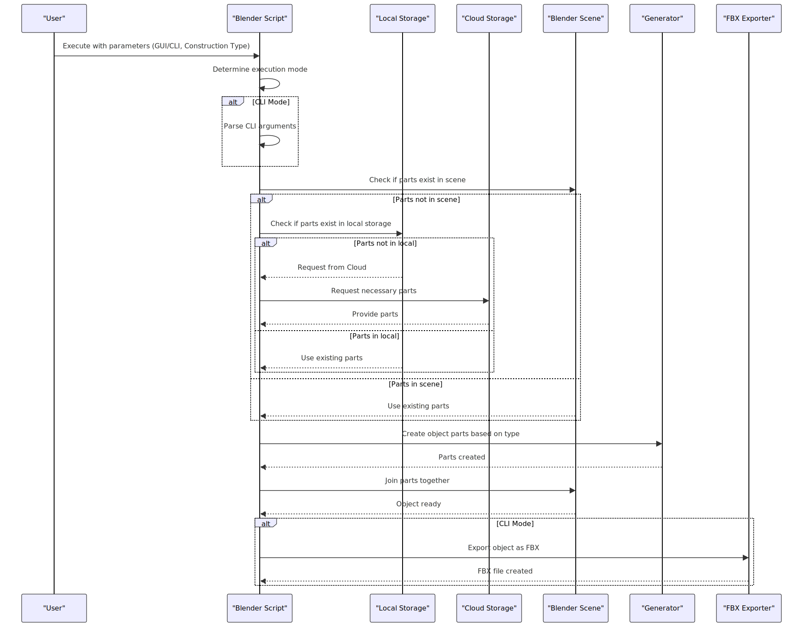

**Slovy proces vypadá asi takto:**
- Uživatel zavolá skript s parametry, buď přes GUI nebo CLI
	- Pokud CLI, je potřeba dostat parametry z argumentů
- Pak program zkontroluje, jestli má všechny potřebné části už ve scéně
	- Pokud ano, pokračuje dál
	- Pokud ne, podívá se do lokálního uložiště
		- Pokud je tam najde, importuje je do scény
		- Pokud je nenajde ani tam, stáhne je do uložiště z cloud uložiště
- Program pak podle zvolené konstrukce poskládá další potřebné části
- Nakonec je spojí všechny dohromady a vznikne požadované návěstidlo
- Pokud byl skript spuštěn z CLI, je vygenerovaný objekt rovnou exportován jako FBX soubor

## Principy generování návěstidel
Každá konstrukce návěstidel má jiný postup generování. Ačkoliv sdílí nějaké společné části, mají mnoho odlišností. Zde je stručný postup pro každou konstrukci zvlášť.

### Trpasličí konstrukce
Nejjednodušší konstrukce, která se skládá pouze ze základny a světel. Základna je primitivní cube a ní je vygenerované světelné návěstidlo, jehož délka zavísí na zvoleném počtu světel. Návěstidlo je poté lehce nakloněno.
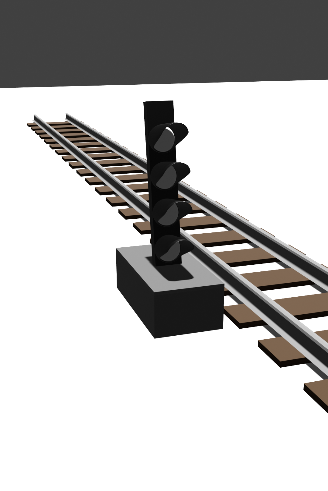
### Stožárová konstrukce
Tato konstrukce také není složitá, přidáváme pouze dlouhý cyllinder objekt, který představuje stožár, na kterém je návěstidlo umístěno. 
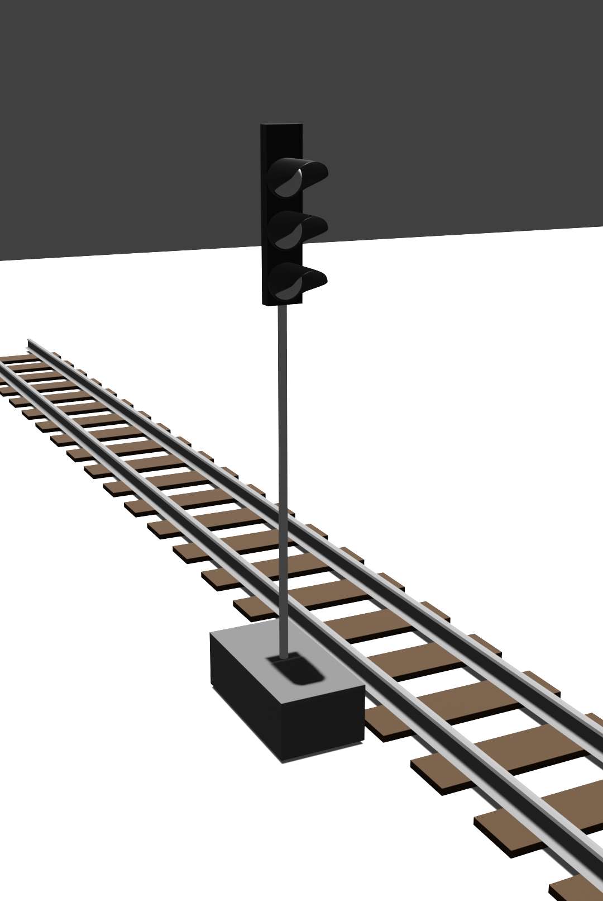


### Krakorcová konstrukce
Tato konstrukce už je výrazně komplexnější. Box který tvoří základní sloup je naimportován z uložiště. Pomocí Array modifieru je následně vyzvidhnut podle zvolené výšky. 

Poté je navrch postaven most. Na jeho straně je pomoci dalších 2 Array modifieru vytvořen plot, který je pomocí Mirror modifieru zrcadlen na druhou stranu. Nakonec, znovu pomocí Array modifieru, připevníme požadovaný počet návěstidel na konstrukci.
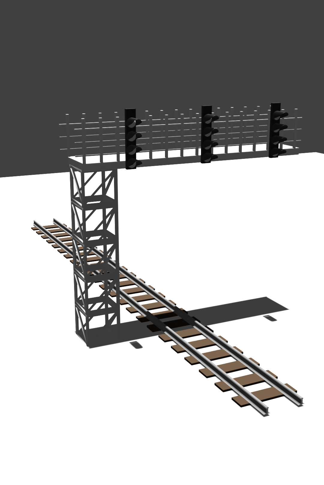
### Přejezdová konstrukce
Tato konstrukce je poskládána z především již hotových částí z uložiště. Základ je tvořen podobně jako stožárová konstrukce, nakonec je přidána závora. V procesu generování je do modelu zabudována i animace zvedání a zavírání závory.
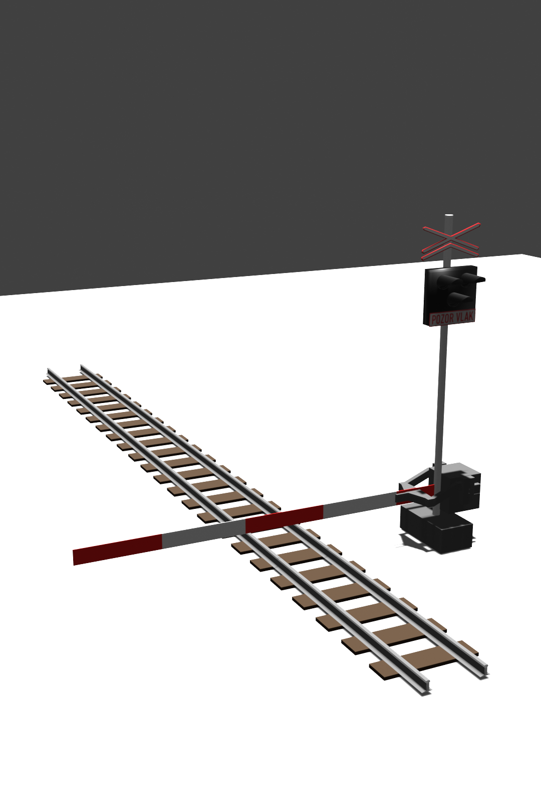
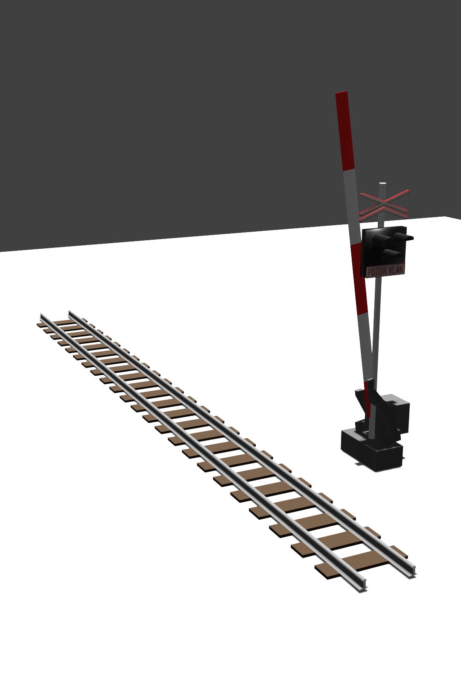

## Proces vizualizace trati s použitím generátoru
Zde je i diagram, který popisuje celý proces vizualizace trati v rámci BI-SP2 projektu, ve kterém je generátor použit.
![[Untitled diagram-2023-12-14-111912.png]]
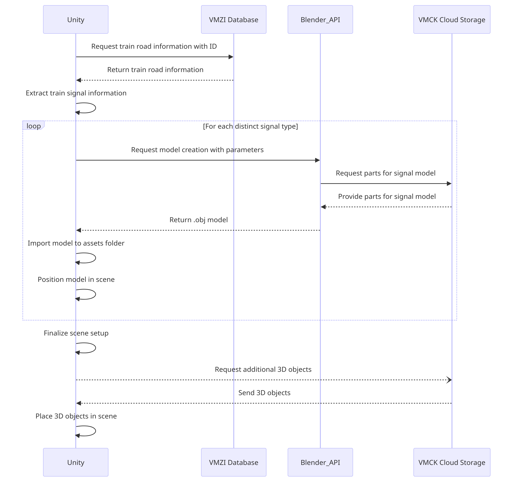

# Ukázky

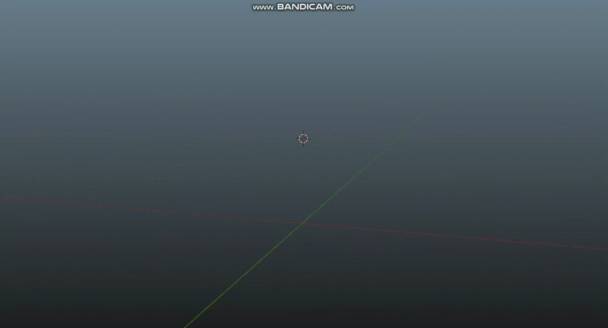
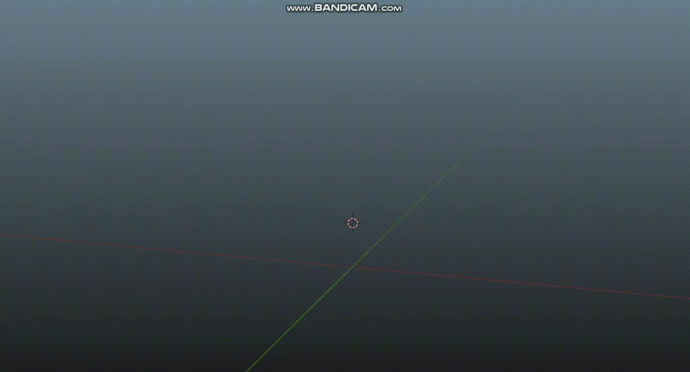
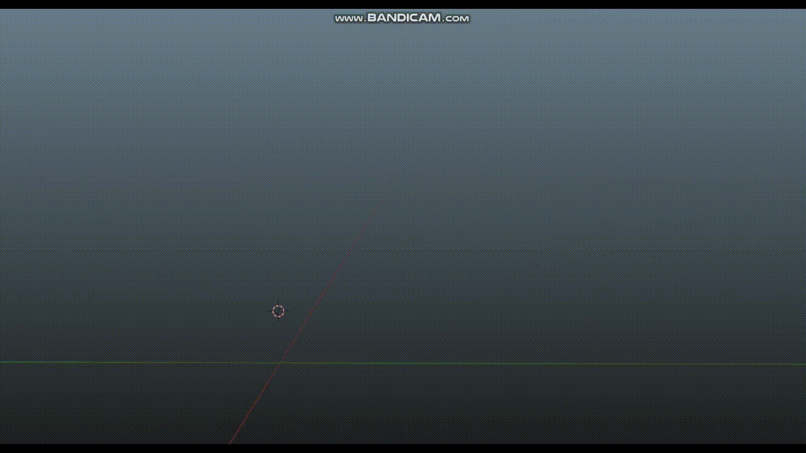
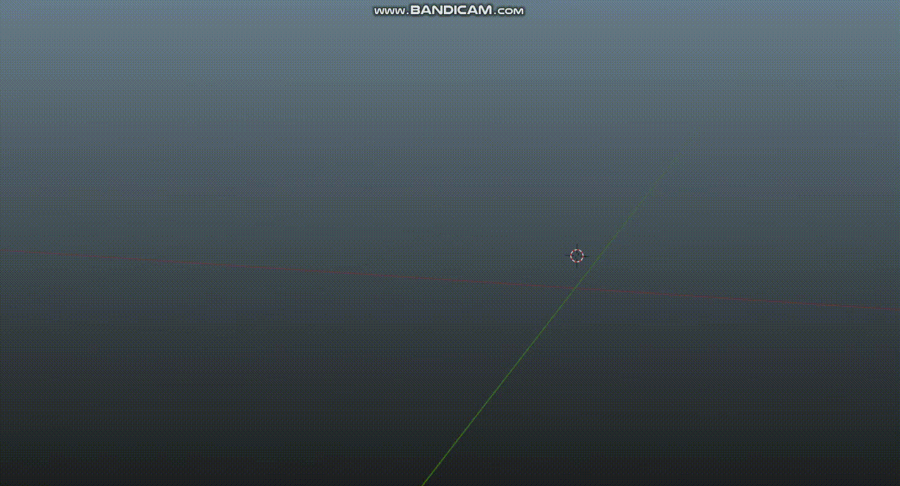

# Ukázka integrace s Unity
Zde je jednoduchá ukázka, kde volám generování objektů pomocí CLI z Unity a můžu si tak naimportovat návěstidlo rovnou do scény pouze zadáním požadovaných parametrů.

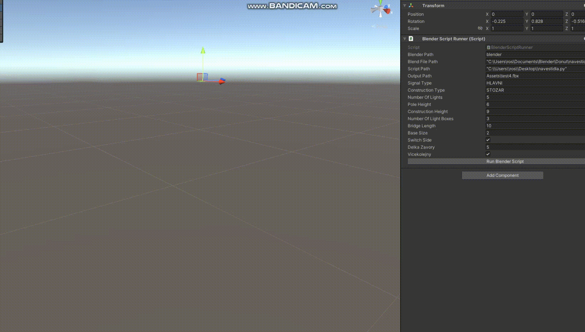

# Implementace
Zde ukážu a popíšu nějaké zajímavé části kodu. Kvůli velikosti kodu popíšu jen pár částí.

## Import potřebných částí z uložiště
Tato třída se stará o import objektů z uložiště. Původně bylo zamýšleno, že budou objekty uložené ve VMCK API, ale z různých důvodů jsou objekty prozatím uloženy na google drive. Přepnout storage na VMCK API je otázkou pár minut. 
```python
class CloudObjectLoader(bpy.types.Operator):
    bl_idname = "object.load_vmck_object"
    bl_label = "Import from VMCK"
    bl_options = {'REGISTER', 'UNDO'}

    model_endpoint: bpy.props.StringProperty()
    object_name: bpy.props.StringProperty()
    
    filepath: bpy.props.StringProperty(default="//VMCK_objects/tmp/")

    def execute(self, context):
        absolute_path = bpy.path.abspath("//VMCK_objects/tmp/")
        if not os.path.exists(f"{absolute_path}{self.object_name}.fbx"):
            print(f"Downloading from {self.model_endpoint}")
            response = requests.get(self.model_endpoint, stream=True)
            file_name = self.model_endpoint.split('/')[-1].split('?')[0]

            os.makedirs(absolute_path, exist_ok=True)
            print(f"Connection response: {response}")

            if response.status_code == 200:
                # Write the file data to a local file
                with open(f"{absolute_path}{self.object_name}.fbx", 'wb') as file:
                    print(f"Opened {absolute_path}/{self.object_name}.fbx")
                    for chunk in response.iter_content(chunk_size=8192):
                        file.write(chunk)
            else:
                print("Failed to retrieve the file, check the URL.")
                return {'CANCELLED'}
        else:
            print(f"Object {self.object_name} already present in the folder, just import.")
        
        # Import the object
        bpy.ops.import_scene.fbx(filepath=f"{absolute_path}{self.object_name}.fbx")
        new_obj = bpy.data.objects.get(self.object_name)
        if new_obj:
            # Move them away
            new_obj.location = (10,10,-10)
        return {'FINISHED'}
```

## Vytváření světelného návěstidla
```python
    # Generate the light box
    def generate_light_box(self, props, z_offset, x_offset = 0, y_offset = 0):
        to_join = []
        
        # Calculate light offset
        first_light_y_offset = self.first_light_y_offset
        light_offset = (self.light_height + self.light_spacing) 
        
        # Duplicate and position lights
        original_light = bpy.data.objects.get(LIGHT_OBJECT)
        if original_light is not None:
            for i in range(props.number_of_lights):
                new_light = original_light.copy()
                new_light.data = original_light.data.copy()
                bpy.context.collection.objects.link(new_light)
                new_light.location = (x_offset, y_offset, first_light_y_offset + z_offset + i * light_offset)
                new_light.name = f"TrafficLight_{i+1}"
                
                to_join.append(new_light)
        else:
            print("LightObject not found in the scene")
        
        # Generate the backing for the lights
        backing_height = props.number_of_lights * (self.light_height + self.light_spacing) + first_light_y_offset
        
        if(props.construction == 'STOZAR'):
            pole_height = props.pole_height
        else:
            pole_height = 0
            
        backing_location = (x_offset, y_offset + self.backing_depth / 2,  z_offset + (backing_height / 2))
        backing = self.generate_backing(props, backing_location, backing_height)
        to_join.append(backing) 
        
        light_box = join_objects(to_join)
        lb = bpy.context.object
        
        # Create and assign grey material to the lightbox
        black_mat = create_material("BlackMaterial", (0.0, 0.0, 0.0, 1))
        assign_material(lb, black_mat)
        
        return light_box
```

## Vytváření pruhovaného materiálu pro závoru
```python
    def create_striped_material(self, obj):
        mat = bpy.data.materials.new(name="StripedMaterial")
        obj.data.materials.append(mat)
        
        mat.use_nodes = True
        nodes = mat.node_tree.nodes
        
        nodes.clear()

        # Create necessary nodes
        material_output = nodes.new(type='ShaderNodeOutputMaterial')
        bsdf = nodes.new(type='ShaderNodeBsdfPrincipled')
        checker = nodes.new(type='ShaderNodeTexChecker')  # Checker texture node

        # Set up the checker texture
        checker.inputs[1].default_value = [1,1,1,1]
        checker.inputs[2].default_value = [1,0,0,1]

        # Link nodes
        texcoord = nodes.new(type='ShaderNodeTexCoord')
        mapping = nodes.new(type='ShaderNodeMapping')
        mat.node_tree.links.new(bsdf.inputs['Base Color'], checker.outputs['Color'])
        mat.node_tree.links.new(material_output.inputs['Surface'], bsdf.outputs['BSDF'])
        mat.node_tree.links.new(mapping.inputs['Vector'], texcoord.outputs['Generated'])
        mat.node_tree.links.new(checker.inputs['Vector'], mapping.outputs['Vector'])
        
        mapping.inputs['Scale'].default_value[0] = 1.0
        mapping.inputs['Scale'].default_value[1] = 0.0
        mapping.inputs['Scale'].default_value[2] = 0.0
        
        return mat
```

## Vytváření části plotu u krakorcové konstrukce
```python
    def create_fence_poles(self, height, thickness, z_coord, x_coord, y_coord, bridge, bridge_length, space_between, spacing):
        bpy.ops.mesh.primitive_cube_add(size=1, location=(0, 0, z_coord))
        fence_stick = bpy.context.object
        fence_stick.scale[0] = thickness
        fence_stick.scale[1] = thickness
        fence_stick.scale[2] = height
        bpy.ops.object.transform_apply(location=False, rotation=False, scale=True)
        
        fence_stick.location.x += x_coord
        fence_stick.location.y -= y_coord
        
        bpy.ops.object.modifier_add(type='MIRROR')
        bpy.context.object.modifiers["Mirror"].mirror_object = bridge
        bpy.context.object.modifiers["Mirror"].use_axis[0] = True
        
        bpy.ops.object.modifier_add(type='ARRAY')
        bpy.context.object.modifiers["Array"].fit_type = 'FIT_LENGTH'
        bpy.context.object.modifiers["Array"].fit_length = bridge_length
        
        bpy.context.object.modifiers["Array"].relative_offset_displace[0] = 0
        bpy.context.object.modifiers["Array"].relative_offset_displace[1] = spacing
        
        bpy.ops.object.modifier_apply(modifier="Array")
        bpy.ops.object.modifier_apply(modifier="Mirror")
        
        return fence_stick
```

Zbytek kodu je možné si prohlédnout ve zdrojovém souboru.
